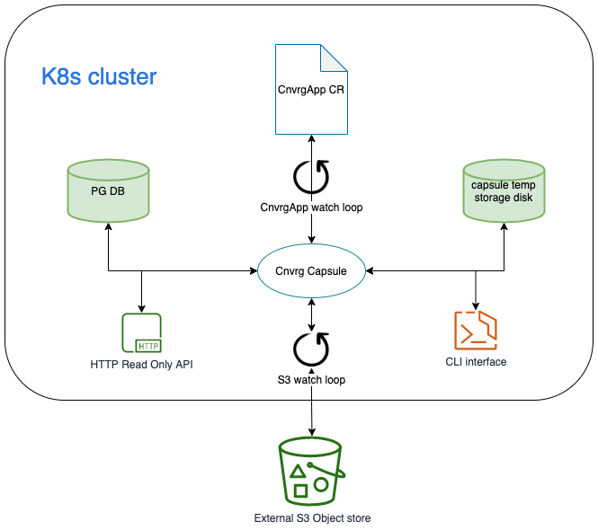
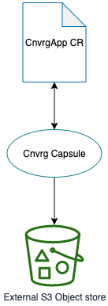
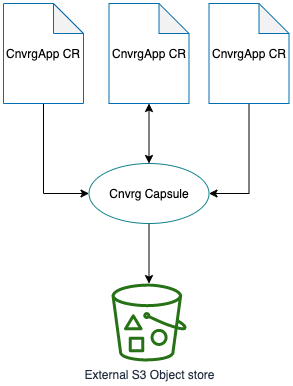
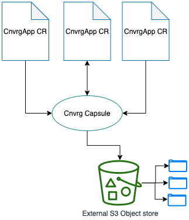
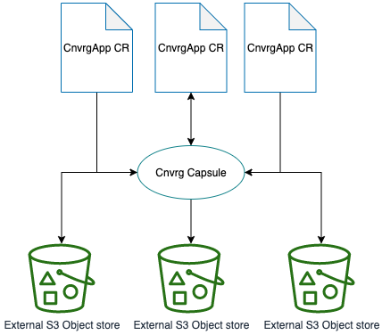
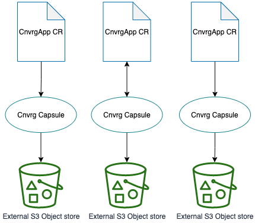

# Cnvrg Capsule - Smart backup/restore engine for cnvrg control plane

### Motivation 

Cnvrg is an AI/MLOps end-to-end platform, and as a such it's should provide 
out of the box backups and restore solutions to ensure platform durability and reliability. 
The `cnvrg-capsule` service shipped within the cnvrg platform and is responsible for managing ( data and metadata) backups of platform critical, system workloads, such as PostgreSQL, Redis, ElasticSearch and others. 

### Concepts 
The goal of the backup systems is to minimise the downtime of the service in case of disaster. 
This means, it’s not enough to just create backup files and store them in a remote location. 
To reach the goal, backup/restore system must ensure that
* backups are valid, not corrupted, and they are actually able to restore the broken system 
* backups are stored in secure remote locations, which won’t be affected, even if the whole main system will goes down 
* backups are available for restore on demand 

### Cnvrg Capsule - overview
The cnvrg capsule service is designed as a simple, reliable backup and restore solution, which follows the main goal of the backup systems, it tries to minimise the service downtime as much as possible. 
The cnvrg capsule doesn’t manage any internal state, which makes this service completely stateless. Stateless allow to deploy and scale cnvrg capsule easily. 
The cnvrg capsule backups is depends on two components:
1. The S3 bucket - which is acts as backend storage for backups 
2. The `statefile.json` file, which is saved alongside with the actual backup and holds all the information about the actual backup, when it has been made, if the backup process has been successfully finished, etc. 

These two concepts (S3 bucket and `statefile.json`) make cnvrg capsule backups to be completely agnostic to any external systems, even when a potential user will completely loos the complete K8s cluster and all the storage disks, until the S3 bucket will be available, the data can br restore based on the actual backup file and the `statefile.json` that hold all the necessary metadata for the successful restore.

### Cnvrg Capsule - architecture 
Capsule has been designed as a standalone tool, but it provides 3 interfaces for backup management. 
The backup management includes operations like automatic backup discovery, 
configuration of rotation and period, etc. 
Probably the most efficient way to use a capsule is in conjunction
with `cnvrg-operator` and the `CnvrgApp` custom resource. 

The interfaces

* `CnvrgApp` scanner - capsule is capable to scan all the `CnvrgApp` instances in the cluster and build on top of its backup plan. (what to deploy, where to deploy, how often to deploy, etc..)  
* The HTTP API (allowing to list available backups per cnvrg cluster)
* The S3 watcher API (listing, and executing an backups per backup requests) 

Architecture schema: 

Deployment options:

The backup flow:

Capsule backup engine includes 4 main internal processes (goroutines)  
* The 1 goroutine is responsible for discovering and creation for backup requests, 
* The 2, and 3 is are responsible for executing actual backups
* The 4 is a cli (the capsule binary at self)

1. Discover PG backups: this infinite loop, list all the existing `CnvrgApp` each X seconds in the cluster, checking if PG backup has been enabled, and if yes, creating a  backup request (the `statefile.json`) file to destination S3 bucket
2. Discover bucket configuration for backups: this infinite loop, list all the existing `CnvrgApp` objects, extract the destination bucket connection details and send them to `BucketsToWatchChan` channel 
3. Scan bucket for backup requests: this infinite loop, receive a S3 bucket object over the channel, and execute bucket scan for incomplete backup request, and then initiate actual backup process.

### Usage 

The cnvrg capsule will be automatically deployed by `cnvrg-operator`. 
To deploy the capsule manually inside K8s cluster, 
just create all K8s manifest from `./deploy` directory, or run `make deploy` 

To install`capsule` locally on your Mac or Linux workstation, clone the repo and run
* Mac: `make build-mac` will create `bin/capsule-linux-x86_64` 
* Linux: `make build-linux` will create `bin/capsule-darwin-x86_64`

